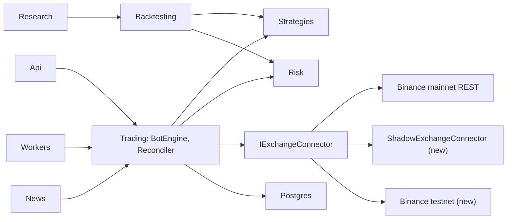

# TradingProject — Full Audit Report

Date: 2026-10-05. Baseline ("BEFORE") is commit `9de7b7d` plus the in-progress work that was already in the tree. "AFTER" is the working tree at the end of this audit. No real-money order was placed during the audit. Live activation remains a manual human step (see section 19).

Source artifacts referenced below:

- Strategy scorecard: `artifacts/research/audit/scorecard.md` and `scorecard.json` (corrected impact model). The first run, with the per-bar impact model, is kept as `scorecard-v1-bar-impact.md` / `.json`.
- News event study: `artifacts/research/news-study/news-event-study.md` and `.json`.
- Performance harness: `artifacts/research/perf.md`.
- Experiment registry: `artifacts/research/registry/`.

---

## 1. Executive Summary

- **The platform is safer and more correct, but no strategy has a demonstrated edge.** 41 strategy/timeframe rows were backtested on 150 coins with real funding, three cost profiles and a sealed out-of-sample window. 39 testable rows are REJECTED, one is RESEARCH (9 trades), and two cannot be tested because open-interest history is too short. **0 rows reached PROMISING, so the sealed OOS window was never opened.** No strategy should be traded with real money on current evidence.
- **The loss is not a cost-model artifact.** Even with slippage set to zero, no row has positive gross PnL minus fees plus funding in both the in-sample and the validation period.
- **Critical safety defects were fixed**, each with a regression test:
  - The control plane was anonymous (anyone could start bots, arm news trading or save API keys). It now requires JWT, and every mutation requires the Operator policy.
  - Live trading was enabled in committed config. It is now off, and placeholder secrets stop the process outside Development.
  - The emergency stop only stopped bots. A real `FlattenAll` path now cancels protection, closes reduce-only, and verifies against the exchange.
  - A stop-loss failure could leave a naked position. Failures are retried, and the position is flattened if protection cannot be restored.
  - Live strategies were starved of higher-timeframe and futures context, and the stale-data guard was hard-coded to 0 ms. Live and backtest now share one context builder, with a parity test.
  - Unknown fees were booked as zero and BNB fees were subtracted from USDT. PnL is now gross, fees, funding and a nullable net.
- **New forward-testing modes**: Shadow (simulated account on real public prices, no signed API) and Testnet. Both run the same engine, risk and sizing code as Live, and are fenced off from the live database and mainnet hosts.
- **Research framework**: BASE / CONSERVATIVE / STRESS cost profiles, an experiment registry, Deflated Sharpe and Benjamini-Hochberg corrections, a sealed OOS vault, perturbation, bootstrap and Monte Carlo, and a survivorship flag.
- **News intelligence is not testable yet.** The collector ran about once a day. 82% of stories arrived more than 60 minutes after publication, and the live rule produced 0 signals over 8 days.
- **Tests**: 587 → 851, all passing in a Release build. `NewsTests` now runs in the solution test pass.

## 2. Original Architecture

- **Projects (`src/`)**:
  - Api, Workers, Application, Domain, Infrastructure (EF Core, Postgres).
  - Binance: REST only at baseline.
  - MarketData, Strategies, Risk.
  - Trading: `BotEngine`, the reconciler, coin occupancy.
  - Execution, Backtesting, Research, News.
- **Frontend and tools**: Angular frontend in `frontend/trading-platform-ui`. Research CLIs in `tools/`.
- **Runtime**:
  - Live was the only mode; paper simulation had been removed.
  - Each bot runs one strategy version on one coin under an Isolated-margin risk book.
  - Stop loss and take profit are `closePosition` algo orders on `MARK_PRICE`.
  - The engine was a scoped service rebuilt every cycle. API and Workers could both host it at the same time.
- **Data**:
  - Postgres is the only hard dependency.
  - Redis is in config and docker-compose but nothing registers or uses it (still true, see section 17).
  - Kline caches cover about 529 coins on 5m, 15m and 1h. Funding history covers 527 coins. Open-interest history covers only about 40 days.
- **Strategies**:
  - 16 canonical strategies run through `RefactoredStrategyEvaluator`, plus an operator catalog of 27 entries and many research-only families.
  - There is no cross-strategy signal fusion; coin occupancy is the only arbitration.
- **Tests at baseline**: 587 tests in 6 projects. `NewsTests` was outside the solution pass.

## 3. Critical Bugs Found

P0 items could cause money loss or a security breach. P1 items are high-severity correctness bugs.

| ID | Problem |
|---|---|
| P0-1 | `[AllowAnonymous]` on `TradingController`, `NewsDeskController`, `ExchangeController` and `TradingHub`. Anyone could start bots, arm live news trading, or save API keys. The JWT key had a `CHANGE-ME` fallback. |
| P0-2 | `LiveTradingEnabled: true` in the committed API appsettings. |
| P0-3 | The emergency stop only stopped bots and never reduced exposure. |
| P0-4 | Position mode (one-way vs hedge) was never checked, and no `positionSide` was sent. |
| P0-5 | After a stop-loss placement failure, the position stayed open without protection. The ratchet cancelled the old stop before placing the new one. |
| P0-6 | Live context never set the higher-timeframe cache. BinHV45, Cluc, Flow Zone and EMA RSI always returned `DATA_UNAVAILABLE`. Open-interest and funding arrays were 1–2 elements long where evaluators require candle alignment. |
| P0-7 | `MarketDataAgeMs = 0` was hard-coded in three places, so the stale-data guard never fired. |
| P0-8 | `BotEngine` was scoped, so signal dedup and backoff state reset every cycle. API and Workers could run two engines at once. |
| P0-9 | News live sizing used a hard-coded $10,000 equity. |
| P0-10 | Unknown fees became 0 in PnL, and BNB fees were subtracted from USDT amounts. |
| P1 | Exchange trade id was not unique. An order marked Failed after a "not found" lookup was never re-checked. Manual close ids were not idempotent. `CancelAllOrdersAsync` was a no-op. There was no user-data stream. |
| P1 | Live sizing assumed 0 fee and 0 slippage. The daily loss limit let open gains offset realized losses. `DrawdownKnown` was hard-coded. There was no daily halt in paper or backtests. The liquidation estimate ignored maintenance margin. A withdrawal counted as drawdown. |
| P1 | Sharpe was computed per trade × √N, which inflates with trade count. Gap stops applied slippage twice. API backtests omitted funding. Kline paging had no dedup, sort or gap detection. Seeder timeframe overrides fought the canonical timeframe (`donchian_breakout` seeded as 5m instead of 4h). |
| P1 | Integration tests migrated the local development database. |
| P2 | News `SchemaNewsClassifier` returned its input unchanged, so with AI enabled every event was Unknown. Clusters used the latest copy's time as the detection time, which is look-ahead. Copies of a non-first cluster member opened a new event. News confirmation could see candles that closed after the decision. Comments in appsettings crashed `--news-live`. |
| Found during reporting | The seeder created an Admin (Admin = Operator) with the password `ChangeMe_Admin_123!` when none was configured. The same password was committed in appsettings and pre-filled on the login page, so it shipped in the frontend bundle. |
| Found during research | The research impact model used per-bar volume: 1% × √(notional / bar quote volume). That overstated impact by roughly √(bars per day) relative to the standard daily square-root law: about 4× on 5m and 2× on 15m. |

## 4. Bugs Fixed

Every row has at least one regression test. Test names are the actual method names.

| Bug | Fix | Regression tests |
|---|---|---|
| P0-1 anonymous control plane | JWT on every trading, news, exchange and hub endpoint. An `OperatorMutationsConvention` puts the Operator policy on every non-GET action. Self-registration is off by default. Frontend auth guard and interceptor. | `Anonymous_requests_to_trading_surface_are_rejected`, `Non_operator_cannot_mutate`, `Self_registration_is_disabled_by_default`, `Operator_can_disable_cross_sectional_live_and_it_actually_turns_off` |
| P0-1 secrets | `SecretsGuard`: placeholder or short JWT key, placeholder encryption key, or placeholder admin seed password is fatal outside Development, and fatal in any environment when live is on. Workers refuse live with the placeholder encryption key. | `Placeholder_secrets_are_reported`, `Short_or_missing_jwt_key_is_reported`, `Placeholders_are_fatal_outside_development`, `Placeholders_are_fatal_in_development_when_live_is_on`, `Placeholders_only_warn_in_development_with_live_off`, `Workers_refuse_live_with_placeholder_encryption_key`, `Committed_admin_seed_password_is_fatal_outside_development` |
| Default admin password | The seeder no longer invents a password. With `Seed:AdminPassword` unset it seeds no admin and logs a warning. The login page no longer pre-fills a password. | `Committed_admin_seed_password_is_fatal_outside_development` |
| P0-2 live in config | `LiveTradingEnabled`, `ShadowTradingEnabled` and `TestnetTradingEnabled` are false in both committed appsettings. | `Committed_appsettings_keep_live_trading_off`, `Committed_api_and_worker_settings_keep_live_entries_off`, `System_health_reports_live_submission_disabled_by_default` |
| P0-3 emergency stop | `FlattenAll` stops bots, cancels algo orders, sends reduce-only closes with deterministic client ids (local and exchange-only positions), verifies with a fresh position read, and reports what is still open. | `Flatten_all_stops_bots_closes_local_and_exchange_only_positions_and_verifies`, `Flatten_all_reports_what_is_still_open_when_a_close_fails`, `Flatten_client_order_id_is_stable_within_a_minute_and_fits_binance` |
| P0-4 position mode | Read `dualSidePosition` and fail closed on hedge mode or an unknown payload. | `Position_mode_reader_fails_closed_on_unknown_payloads` |
| P0-5 naked position | Bounded stop retries, then flatten (configurable). A failed tighten puts the old stop back, or closes at once if that also fails. | `Stop_that_keeps_failing_on_an_existing_position_is_flattened_after_the_configured_cycles`, `Stop_that_succeeds_on_a_retry_does_not_close_the_position`, `Flatten_on_protection_failure_can_be_turned_off`, `Failed_stop_tighten_puts_the_previous_stop_back_and_keeps_the_position`, `Failed_stop_tighten_that_cannot_restore_the_old_stop_closes_at_once` |
| P0-6 live context | One context builder for live and backtest: higher timeframe from closed bars only, open interest and funding aligned to candle close. | `Live_prefix_evaluation_matches_backtest_index_with_higher_timeframe_and_futures_inputs`, `Context_rules_name_the_inputs_each_template_reads`, `Aligned_open_interest_never_shows_a_value_stamped_after_the_bar_close`, `Higher_timeframe_cache_ignores_the_open_bar` |
| P0-7 stale data | Real `MarketDataAgeMs` from candle close and price time, flagging a missed candle. | `Market_data_age_uses_the_price_time_when_the_candle_is_on_schedule`, `Market_data_age_without_a_live_price_is_the_candle_close_age`, `Market_data_age_flags_a_missed_candle_even_with_a_fresh_price`, `Market_data_age_is_never_negative` |
| P0-8 state and duplicate engines | Singleton `BotCycleState`. A Postgres advisory-lock lease for each background loop. | `Bot_cycle_state_marks_each_candle_once_per_bot`, `Only_one_process_holds_a_lease_and_the_other_takes_over_when_it_goes_away`, `Different_loops_have_independent_leases`, `Unreachable_database_means_no_leadership_instead_of_an_exception` |
| P0-9 news sizing | News uses the real account snapshot and `RiskLiveGuard`, refuses a stale or empty book, and uses stable client ids. | `News_sizing_refuses_a_stale_or_empty_live_book`, `News_client_order_id_is_stable_per_event_and_coin_and_fits_binance` |
| P0-10 PnL | Gross, Fees (with known/pending/uncertain status), Funding and a nullable Net. Mixed or non-USDT fees stay pending with a reason. Funding is attributed to each trip's time window. The UI shows "pending" instead of a guessed number. | 16 tests in `TradePnlTests` (for example `Long_gross_and_net_match_hand_math`, `Mixed_fee_assets_are_uncertain_not_summed`, `Resync_that_loses_the_fee_marks_it_uncertain_instead_of_zero`, `Funding_is_attributed_to_the_trip_window_by_coin`), plus `Manual_close_with_a_bnb_fee_keeps_gross_and_leaves_net_pending` and `Manual_close_before_the_commission_is_reported_leaves_net_pending` |
| P1 duplicate executions | Filtered unique index on `ExchangeTradeId` plus a dedup migration. | `An_exchange_trade_id_is_booked_once`, `Migrations_apply_and_match_the_model` |
| P1 Failed-order race | A verify window. An absent order stays uncertain inside the window and is not failed while Binance holds an unbooked position. | `Absent_order_inside_the_verify_window_stays_uncertain`, `Absent_order_after_the_verify_window_is_failed`, `Absent_order_is_not_failed_while_binance_holds_an_unbooked_position`, `Absent_lookup_is_final_only_after_a_rejection_or_the_window` |
| P1 crash recovery | Every crash point between submit and booking recovers without resending. | `Crash_after_binance_filled_a_close_books_it_on_restart_without_resending`, `Crash_recovery_run_twice_books_the_close_once`, `Crash_after_a_partial_close_keeps_the_rest_open`, `Crash_before_the_submit_reached_binance_is_failed_after_the_window_and_not_resent` |
| P1 manual close | Idempotent client id per position size and minute. Refused while an earlier close is unresolved. Gross and net are booked correctly. | `Manual_close_client_order_id_is_stable_per_position_size_and_minute`, `Manual_close_is_refused_while_an_earlier_close_is_unresolved`, `Manual_close_still_runs_when_only_an_entry_is_unresolved`, `Manual_close_after_a_rejected_close_in_the_same_minute_gets_a_fresh_id`, `Manual_close_books_gross_pnl_and_a_usdt_net` |
| P1 ghost positions | A position missing from a fresh exchange snapshot is retired with Fee = Uncertain and Net = null. It is rebuilt by the trade-history sync, never with an invented mark-price PnL. | covered by the reconciler path and the `TradePnlTests` pending/uncertain rules |
| P1 CancelAll / errors | Real per-coin `CancelAllOrdersAsync`. Unknown-outcome signed failures are not called rejections. Binance error codes are preserved. | `Open_algo_ids_are_read_for_one_coin_only`, `Signed_failures_with_unknown_execution_are_not_called_rejections`, `Binance_error_text_keeps_the_code_callers_match_on` |
| P1 user-data stream | Listen key, `ORDER_TRADE_UPDATE`, `ACCOUNT_UPDATE`, keepalive, capped reconnect backoff. Events wake the engine. REST stays the reconciliation fallback. | 9 tests in `UserDataStreamTests` |
| P1 risk | Realized daily loss (open gains no longer offset it), weekly loss, persisted equity-drawdown series, fee- and spread-aware live sizing, spread and range-shock entry guard, liquidation from the maintenance-margin bracket. | 7 in `RiskEngineTests`, 13 in `RiskLossLimitTests`, `Live_entry_checks_the_book_spread_and_sizes_with_the_account_fee` |
| P1 backtest | Daily-equity Sharpe and Sortino. Gap stops fill at the open with slippage once. Occupancy replay fills stops like the single-book replay. Funding is passed into API backtests. | 7 tests in `BacktestMetricsAndDataTests` (for example `Sharpe_does_not_grow_with_the_number_of_trades_on_the_same_daily_equity`, `Stop_fills_at_the_stop_or_at_the_open_when_the_bar_gaps_through_it`) |
| P1 market data | Kline pages deduplicated and sorted; gaps reported. | `Kline_pages_are_deduplicated_and_sorted`, `Missing_klines_are_reported_as_gaps`, `A_complete_series_has_no_gaps` |
| P1 seeder | Each catalog row is seeded on a timeframe its template accepts, the canonical one for canonical ids. | `Every_catalog_row_is_seeded_on_a_timeframe_the_template_accepts`, `Canonical_rows_seed_on_the_canonical_timeframe_not_the_old_override` |
| P1 tests on dev DB | Integration tests use their own database from `ConnectionStrings__TradingPlatform`. | `Migrations_apply_and_match_the_model` |
| News bugs | First-copy detection time, cluster membership via any member, AI classifier falls back to rules, no future candles, stale candles stop the decision, appsettings comments parse. | `An_event_is_detected_when_the_first_copy_arrives`, `A_copy_of_any_clustered_article_joins_that_event`, `Ai_classification_without_a_model_client_still_scores_events`, `Candles_that_close_after_the_decision_are_not_visible`, `Stale_execution_candles_stop_the_decision` |
| Research impact model | Impact = daily volatility % × √(notional / daily quote volume), capped at 0.5%. The scorecard harness passes 30-day daily volatility and daily quote volume. The existing test's expected values were changed to the new formula. This corrects a wrong formula; the test was not weakened. | `Cost_profiles_escalate_and_stress_adds_a_bar_of_delay` (new cases for zero volume, zero volatility and zero notional) |
| Universe censoring | The point-in-time universe treated every coin whose cache starts at the window start as "not yet listed". | the corrected scorecard reports Eligible 82 / NotYetListed 68 instead of 10 / 140 |
| Hygiene | `NewsTests` added to the solution. Stray `tmp-waxp.sql` removed. | — |

## 5. Reliability Improvements

- **Single active engine per loop.** Postgres advisory-lock leases for the bot engine, news live, universe refresh and cross-sectional workers. API and Workers can both run; only the lease holder cycles. If the database is unreachable, the process has no leadership rather than crashing.
- **Durable per-bot cycle state** (`BotCycleState`, singleton), so signal dedup, flat-candle tracking and ratchet backoff survive scope recreation.
- **Order state recovery.** A verify window for absent orders, crash-point recovery at every step, and no resends on restart.
- **User-data websocket** for fills and account updates, with REST polling kept as the fallback and the source of truth for reconciliation.
- **Health.** `/api/system` reports venue, whether entries are enabled, exchange readiness and reconciliation readiness. The UI shows a DATA STALE badge when either readiness check fails.

## 6. Trading Engine Improvements

- **Shared context builder.** Live and backtest give strategies the same higher-timeframe and aligned futures inputs. The parity test asserts identical signals on identical candles.
- **Protection lifecycle.**
  - Stop placement is retried and the position is flattened if the stop cannot be restored.
  - Ratchets keep the previous stop on failure.
  - Algo orders are cancelled per coin.
- **Emergency path.** `FlattenAll` is separate from "stop bots" and verifies the result against Binance.
- **Deterministic client order ids** for flatten, manual close and news entries, all within Binance's 36-character limit.
- **Venue abstraction.** One `IExchangeConnector` for Live, Shadow and Testnet. Each venue has its own entries switch; the gate message names the switch.

## 7. Risk Improvements

- **Loss limits.**
  - Realized daily loss: open gains no longer offset it.
  - Weekly loss: the week starts Monday UTC.
  - Drawdown from a recorded equity peak, using a persisted, throttled equity series. A limit of 0 disables a halt explicitly.
- **Entry-time guards.**
  - Book spread against mid; a missing or crossed book counts as no spread.
  - Range-shock: the last bar's range compared with the median, requiring history.
  - Stale data via the real `MarketDataAgeMs`.
- **Sizing.**
  - The account's real taker fee is read as a percent, and bad values are rejected.
  - The slippage estimate is at least half the spread.
- **Liquidation.**
  - The maintenance-margin bracket holding the notional is used, with its maintenance amount.
  - A stop inside the maintenance buffer is denied even when the bankruptcy price would allow it.
- **One risk path.** News and cross-sectional entries go through `RiskLiveGuard`, the same path as bots.
- **Not enforced:** correlation and BTC-beta heat (`PortfolioRisk.CorrelatedHeat`). The plan required research first. H6, the related "max same-side entries per bar" hypothesis, was rejected in every row (section 8).

## 8. Strategy Improvements

**Protocol.** Each strategy runs on the 150 most liquid coins with at least a year of cached data. The rules are:

- **Splits:** IS 60% (about 706 days), Validation 20% (about 280 days), OOS last 20% sealed.
- **Risk book:** $10,000 per coin, 0.5% risk, 3× leverage, book stop 2% / take profit 4% unless the template supplies structural stops.
- **Funding:** real settlements.
- **Cost profiles:** BASE, CONSERVATIVE and STRESS. STRESS adds a one-bar execution delay.
- **Gates for PROMISING:** Validation PF > 1.15 under CONSERVATIVE, family DSR > 0.9, breadth > 55%, BH-FDR discovery, and stable ±20% parameter neighbours.

**Results.** All 39 testable rows failed the Validation gate, so perturbation and the OOS vault were never run. Results by family:

- **Best Validation PF:** `fadx_sma` 1h at 0.96, `rsi_pullback` 1h at 0.94 (32 trades), and `btc_ema20_ema50_long` 30m at 0.92 (148 trades, BTC only). All have IS PF ≤ 0.75, so the Validation numbers are not confirmed in-sample.
- **High-frequency families** (macd_trend, liq_sweep, vwap_breakout, market_structure, vol_squeeze, supertrend, bb20, vol_spike on 5m and 15m) lose the most. Gross PnL is around zero and costs dominate.
- **Mean-reversion legacy** (BinHV45, Cluc, combined, bollinger_reversion) has PF 0.21–0.31 under CONSERVATIVE. Gross PnL is negative before costs.
- **Slower trend** (donchian 4h, donchian_v2 1d, hlhb 4h, ts_momentum 1d) has PF 0.61–0.91 with breadth up to 39%. That is closer to break-even but still negative.

**Long vs short** (Validation, CONSERVATIVE):

| Decision | Rows |
|---|---|
| NEITHER: both sides lose | 29 |
| INCONSISTENT: side ranking flips between IS and Validation | 6: `rsi_pullback` 15m and 1h, `donchian_breakout` 4h, `btc_ema20_ema50_long` 30m, `donchian_v2_55` 1d, `fadx_sma` 1h |
| LONG_ONLY or SHORT_ONLY | 0 |

The first run's SHORT_ONLY for `donchian_v2_55` 1d disappeared under the corrected cost model. **No side restriction was adopted in code**, because no row shows a side that is profitable in both IS and Validation.

**Hypotheses H1–H6.** These were applied as trade-list filters or replay variants, 436 tests in total:

| Hypothesis | Tested | KEEP |
|---|---:|---:|
| H1 BTC regime gate (2 variants) | 76 | 0 |
| H2 volatility-targeted size | 39 | 2 |
| H3 break-even after 1R / time stop | 20 | 0 |
| H4 no shorts at extreme negative funding (3 thresholds) | 105 | 0 |
| H5 24h quote volume ≥ $10M / $25M / $50M | 117 | 2 |
| H6 max 3 same-side entries per bar | 39 | 0 |

The 4 KEEPs are:

- H2 on `rsi_pullback` 1h;
- H2 on `fadx_sma` 1h;
- H5 ≥ $10M on `fadx_sma` 1h: Validation PF 0.96 → 1.17, but IS PF 0.79 and STRESS PF 0.96;
- H5 ≥ $25M on `mac_contrarian_7_10` 5m: Validation PF 0.88 → 1.00.

"KEEP" only means the variant improved Validation without hurting IS or STRESS. In every case the IS and STRESS results stay below break-even. Four KEEPs out of 436 is about what chance alone would produce. **None was adopted into strategy code.** They are logged in the registry as research leads.

## 9. New Strategies / Logic Added

- **No new trading strategy was added.** Adding one without validation evidence would contradict the audit's own protocol.
- **New logic:**
  - the Shadow venue and Testnet venue (section 14 and the runbook);
  - `FlattenAll`;
  - the user-data stream;
  - the risk limits in section 7;
  - the news event study (`NewsEventStudy`, `--news-event-study`);
  - the audit scorecard harness (`--audit-scorecard`);
  - the performance harness (`--perf`);
  - a binary-search higher-timeframe lookup.

## 10. Backtesting Improvements

- **Metrics.** Sharpe and Sortino come from daily equity returns starting at initial equity. Too few days, or no losing day, gives no ratio instead of a huge one. Calmar is annualized return over drawdown.
- **Fills.**
  - Gap stops fill at the open with slippage once.
  - Occupancy replay fills stops the same way as the single-book replay.
  - An execution-delay option moves every fill one bar later.
- **Costs.**
  - BASE uses the taker fee plus the sampled or default half-spread per liquidity bucket.
  - CONSERVATIVE uses 2 × (half-spread + impact) + 0.01%.
  - STRESS uses a 0.075% fee, wider slippage and a one-bar delay.
  - Real funding applies in every profile and in API backtests.
- **Impact model corrected** (section 4). Effect on Validation CONSERVATIVE PF: +0.05 to +0.2 on 5m and 15m rows, almost none on 1h and above. Examples:
  - `macd_trend` 5m: 0.15 → 0.31; slippage $785k → $609k against $159k fees.
  - `liq_sweep_continuation` 5m: 0.47 → 0.66.
  - `fadx_sma` 1h: 0.94 → 0.96.

  Verdicts were unchanged. Slippage is still 3–6× fees on 5m and 15m, because CONSERVATIVE doubles spread and impact on small coins. Shadow and Testnet fills are needed to calibrate it (section 17).
- **Data.** Kline dedup and sort, gap detection, and a data fingerprint in the registry.
- **Universe.** A point-in-time universe from `onboardDate`, with a survivorship flag on every result. The left-censoring bug is fixed.

## 11. Research Improvements

- **Experiment registry** (`artifacts/research/registry/*.jsonl`). It records hypothesis, parameters and data fingerprint, counts distinct configurations per family, and survives reloads.
- **Multiple testing.**
  - Deflated Sharpe per family and across all trials (436 trials in this run).
  - Benjamini-Hochberg with q = 0.10.
- **Sealed OOS vault.** It hands out the last 20% once and logs each access. It was opened 0 times this session, because nothing reached PROMISING.
- **Robustness.**
  - ±20% parameter neighbours, with 70% required to hold.
  - Seeded block bootstrap.
  - Monte Carlo trade-order shuffle for the drawdown distribution.
  - Breadth: the share of coins with positive PnL.
  - BTC regime split.
- **Verdict rules are executable and tested.** No LIVE_CANDIDATE is possible without forward-test evidence.

## 12. News Intelligence Improvements

Fixes are listed in section 4. The event study (`artifacts/research/news-study/`) covers 303 events from 306 unique articles, 2026-09-27 to 2026-10-05.

**Collection cadence and latency.**

- The collector ran 9–17 times in 8 days, about once a day, so latency mostly measures how often it was run.
- Median publish → first retrieval is 176 minutes. 82% of stories exceeded the 60-minute freshness limit.

**Classification.**

| Direction | Events |
|---|---:|
| Unknown | 196 |
| Bullish | 48 |
| Bearish | 36 |
| Neutral | 18 |
| Mixed | 5 |

Only 3 events were built from more than one article.

**Live rule.** It produced 0 signals. Rejections:

| Reason | Events |
|---|---:|
| Age | 74 |
| Impact | 8 |
| Confidence | 7 |
| News score | 1 |
| Market conflict | 1 |

**Forward returns.** These were measured from the first bar close after first sighting, signed by direction, against a placebo at −24 h, with a 0.14% round-trip cost. The best group, news gates at any age over 4 h, has n = 10, mean +0.52% and t = 1.69. That is too few events to mean anything.

**Conclusion: NOT TESTABLE.** The news path stays research-only until a continuous collector (every 1–5 minutes) runs in Shadow for at least 4 weeks.

## 13. Performance Improvements

Measured with `--perf` (`artifacts/research/perf.md`):

| Item | Before | After |
|---|---:|---:|
| Higher-timeframe lookup, 35k lookups | 4,151 ms | 9 ms (binary search on close time; a test checks it against a backward scan at every signal time) |
| Template replay | ~3.5 ms per 1k bars, linear | unchanged |
| Rule (non-template) strategies | 1k bars 408 ms, 2k 1,699 ms, 4k 7,362 ms (quadratic) | **not fixed** |
| Full scorecard, 751 datasets, 150 coins | 46 min, first run in Debug with a parallel load | 25 min in Release |

The quadratic case comes from `StrategyEngine.Evaluate`, which recomputes indicator series over the whole prefix on every bar. It is documented as a remaining problem.

Other changes: bulk ticker prefetch and an IP-weight gate for Binance public calls (the in-progress work, kept and finished), and `BotCycleSchedule` for per-bot cycle scheduling.

## 14. Security Improvements

- **Access control.**
  - JWT is required on all trading, news-desk, exchange and hub surfaces.
  - The Operator policy (Admin role) is required for every mutation, applied by convention so new actions cannot be forgotten.
  - Self-registration is off by default.
- **Secrets.**
  - A placeholder JWT key, encryption key or admin seed password is fatal outside Development, and fatal in any environment when live is on.
  - The seeder no longer invents an admin password.
  - The login page no longer pre-fills credentials.
  - Binance API secrets are stored encrypted with `Credentials:EncryptionKey`. Listen-key calls send the API key only, never the secret (`Listen_key_calls_send_the_api_key_only`).
- **Venue fencing.** Shadow and Testnet refuse to start on the live database (the database name must contain `shadow` or `testnet`) or with mainnet order hosts. An unknown venue stops the process.
- **Live switch.** `LiveTradingEnabled` is false in committed config and must be set by a human through environment or deployment config. Health reports the effective state. The frontend shows the venue and "No real orders" outside Live.
- **Frontend.** Risk-profile save and "Save live key" are disabled for non-operators. Risk-profile drafts now seed from the stored profile. Before, a save hard-coded the daily loss limit to 3, the portfolio limit to 4, the buffer to 1 and `allowLive` to true, and `||` treated a stored 0 as missing.

## 15. Test Results

Final run: `dotnet build TradingPlatform.slnx -c Release` succeeded, then `dotnet test TradingPlatform.slnx -c Release --no-build`:

| Project | Before (9de7b7d) | After |
|---|---:|---:|
| UnitTests | — | 550 |
| ResearchTests | — | 152 |
| BacktestingTests | — | 65 |
| NewsTests (now in the solution) | run separately | 55 |
| IntegrationTests (own database) | — | 25 |
| TradingTests | — | 4 |
| **Total** | **587** | **851, 0 failed, 0 skipped** |

Other checks:

- **Frontend:** `npm run build` succeeds. The one warning is the existing `strategies.page.scss` style budget (5.19 kB against a 4 kB budget).
- **Analyzer warnings, reviewed and not blocking:**
  - NU1510: an explicit `Microsoft.Extensions.Logging.Abstractions` package reference in UnitTests.
  - CS0649: `AuditScorecard.Dataset.Futures` is never assigned (research tool).
  - CS0219: an unused variable in `Btc15mFitTests`.
  - Two xUnit1031 warnings: blocking waits in `FuturesHistoryTests`.
- **Fix-first discipline:** the cluster, detection-time and admin-password tests were checked to fail without their fix. No existing test was weakened. The one changed expectation (impact formula) is a corrected formula, with more cases added.

## 16. Before vs After Metrics

| Metric | Before | After |
|---|---|---|
| Tests | 587 (NewsTests outside the solution) | 851, all in the solution, all passing in Release |
| Anonymous mutating surfaces | 4 controllers / hubs | 0 |
| `LiveTradingEnabled` in committed config | true | false |
| Default secrets in a non-development start | silently used | process refuses to start |
| Emergency stop | stops bots only | flattens, cancels protection, verifies |
| Stale-data guard | dead (0 ms hard-coded) | real age, including missed candles |
| Strategies starved of live context | 4 (BinHV45, Cluc, Flow Zone, EMA RSI) | 0 (parity test) |
| Engines per deployment | up to 2 (API + Workers) | 1 per loop (Postgres lease) |
| Unknown fee in net PnL | booked as 0 | pending, with a reason |
| Forward-test modes | none (Live only) | Shadow + Testnet, fenced |
| Sharpe definition | per trade × √N (grows with trade count) | daily equity, annualized |
| Higher-timeframe lookup (35k) | 4,151 ms | 9 ms |
| Strategy evidence | earlier frozen-template report: PF 0.58–0.75, all negative, funding excluded, per-trade Sharpe | 41 rows × 150 coins, real funding, 3 cost profiles: Validation CONSERVATIVE PF 0.21–0.96, 0 PROMISING, OOS sealed |
| Cost model (5m example, `macd_trend`) | — | first run PF 0.15, slippage $785k; corrected PF 0.31, slippage $609k |
| News live signals | not measured | 0 in 8 days (age-gated); NOT TESTABLE |

The strategy rows are not directly comparable. The old report used other assumptions (no funding, per-trade Sharpe, a different universe). The new numbers are more realistic, not better. Per the instruction to keep correctness improvements even when they make results look worse, every realism fix was kept.

### STRATEGY SCORECARD

**How to read it.**

- **Data:** Validation period (about 280 days), CONSERVATIVE costs, real funding, 150 coins unless noted.
- **Expectancy:** net USDT per trade on a $10k book.
- **Sharpe / Sortino:** annualized from the daily equity of all coin books together.
- **Cost sensitivity:** PF under BASE / CONSERVATIVE / STRESS.
- **Parameter sensitivity:** ±20% perturbation, which only runs for rows that pass the Validation gate. "not run" means the row failed first.
- **Regime robustness:** IS PF against Validation PF. Both below 1 means it fails in both regimes.
- **Overfitting risk:**
  - HIGH when there are fewer than 100 Validation trades, or IS and Validation disagree on profitability, or the side ranking flips;
  - LOW when the strategy loses consistently, since there is no edge to overfit;
  - all rows also share survivorship bias, because the universe uses current listings only.
- **OOS quality:** "sealed" means the vault was not opened.
- **DSR:** family Deflated Sharpe probability, with the family trial count in parentheses. DSR across all 436 trials is 0.00 for every row.

**Strategy summary**

| Strategy | Hypothesis | Timeframes | Coins | Final Status |
|---|---|---|---|---|
| ema_rsi_trend | Trend continuation: EMA trend plus RSI pullback with higher-timeframe confirmation | 15m | 150 | REJECTED |
| rsi_pullback | Buy or sell the RSI pullback inside an established trend | 5m, 15m, 1h | 150 | REJECTED |
| bollinger_reversion | Price outside the Bollinger band reverts to the mean | 15m | 150 | REJECTED |
| donchian_breakout | Channel breakouts start persistent trends | 4h | 150 | REJECTED |
| donchian_v2_55 | 55-day channel breakout (turtle-style) | 1d | 116 | REJECTED |
| supertrend_ema_trend | Supertrend flip aligned with the EMA trend | 5m, 15m, 1h | 150 | REJECTED |
| triple_supertrend | Agreement of three Supertrends filters noise | 1h | 150 | REJECTED |
| liq_sweep_continuation | A sweep of recent highs or lows followed by reclaim continues | 5m, 15m, 1h | 150 | REJECTED |
| vol_squeeze_structure | Volatility compression resolves in the structure direction | 5m, 15m, 1h | 150 | REJECTED |
| vwap_breakout_volume | VWAP breakout on high volume continues | 5m, 15m, 1h | 150 | REJECTED |
| market_structure_trend | Higher highs and higher lows (or the reverse) continue | 5m, 15m, 1h | 150 | REJECTED |
| vol_spike_ema_trend | A volume spike in the EMA trend direction continues | 15m | 150 | REJECTED |
| bb20_2_break | A close outside the 20/2 Bollinger band continues | 15m | 150 | REJECTED |
| macd_trend | MACD cross in the trend direction (reference strategy) | 5m, 15m, 1h | 150 | REJECTED |
| btc_ema20_ema50_long | EMA(20) crosses EMA(50) on a closed bar; exit on the reverse cross. The catalog text says all coins and long only, but the scorecard ran it on BTC with both sides, following the template settings (see section 17) | 30m | BTC | REJECTED |
| btc_daily_max_10 | BTC 10-day high breakout, long | 1d | BTC | RESEARCH (9 trades) |
| ts_momentum_28_5 | Time-series momentum: long when the 28-day return is in the top third of its own history, hold 5 days | 1d | 116 | REJECTED |
| impulse_catch | After a recent ~8% run-up, a higher close on above-average volume continues, long | 15m | 150 | REJECTED |
| flat_range | Fade the edges of a flat range | 1h | 150 | REJECTED |
| mac_contrarian_7_10 | Always in the market, opposite to the SMA(7)/SMA(10) band signal | 5m | 150 | REJECTED |
| zigzag_fade | Fade zigzag swing extremes | 15m | 150 | REJECTED |
| binhv45 | Buy sharp drops below the lower band (legacy freqtrade) | 5m | 150 | REJECTED |
| cluc_may72018 | Buy deep dips below the lower band on volume, long (legacy freqtrade) | 15m | 150 | REJECTED |
| combined_binh_cluc | Either BinHV45 or Cluc | 15m | 150 | REJECTED |
| hlhb | EMA 5/10 cross with RSI 50 and ADX confirmation, long | 4h | 150 | REJECTED |
| fadx_sma | SMA(12)/SMA(48) cross with ADX(14) > 30; exit when ADX falls below 30 (freqtrade FAdxSma) | 1h | 150 | REJECTED |
| flow_zone | Open-interest and taker-flow zones | 5m | — | NOT TESTABLE (open interest covers about 40 days) |
| squeeze_watch | Open-interest build-up before a squeeze | 1h | — | NOT TESTABLE (open interest covers about 40 days) |

**Metrics per strategy and timeframe**

| Strategy | TF | Trades | PF | Expectancy | Win rate | Max DD | Sharpe | Sortino | Long PF | Short PF | Cost sens. (B / C / S) | Param. sens. | Regime (IS / Val) | DSR | Overfit risk | OOS | Status |
|---|---|---:|---:|---:|---:|---:|---:|---:|---:|---:|---|---|---|---|---|---|---|
| ema_rsi_trend | 15m | 14618 | 0.40 | -21.16 | 27.3% | 20.6% | -16.7 | -12.9 | 0.40 | 0.40 | 0.54 / 0.40 / 0.35 | not run | 0.51 / 0.40 | 0.00 (11) | LOW | sealed | REJECTED |
| rsi_pullback | 5m | 339 | 0.29 | -17.08 | 15.6% | 0.4% | -5.6 | -5.6 | 0.30 | 0.28 | 0.42 / 0.29 / 0.20 | not run | 0.33 / 0.29 | 0.00 (39) | LOW | sealed | REJECTED |
| rsi_pullback | 15m | 139 | 0.42 | -18.33 | 17.3% | 0.2% | -2.6 | -2.7 | 0.44 | 0.40 | 0.54 / 0.42 / 0.33 | not run | 0.88 / 0.42 | 0.00 (39) | HIGH (side flip) | sealed | REJECTED |
| rsi_pullback | 1h | 32 | 0.94 | -1.49 | 37.5% | 0.0% | -0.1 | -0.3 | 1.14 | 0.86 | 1.31 / 0.94 / 0.32 | not run | 0.46 / 0.94 | 0.00 (39) | HIGH (32 trades) | sealed | REJECTED |
| bollinger_reversion | 15m | 1838 | 0.23 | -27.24 | 22.6% | 3.3% | -14.7 | -11.7 | 0.24 | 0.21 | 0.36 / 0.23 / 0.16 | not run | 0.35 / 0.23 | 0.00 (13) | LOW | sealed | REJECTED |
| donchian_breakout | 4h | 3054 | 0.77 | -6.76 | 27.8% | 2.3% | -2.2 | -3.2 | 0.78 | 0.76 | 0.83 / 0.77 / 0.63 | not run | 1.01 / 0.77 | 0.01 (11) | HIGH (IS ≈ 1, Val < 1) | sealed | REJECTED |
| donchian_v2_55 | 1d | 224 | 0.74 | -8.07 | 37.5% | 0.3% | -1.4 | -1.9 | 0.36 | 0.99 | 0.75 / 0.74 / 0.77 | not run | 0.99 / 0.74 | 0.06 (11) | HIGH (side flip) | sealed | REJECTED |
| supertrend_ema_trend | 5m | 10176 | 0.52 | -10.99 | 25.2% | 7.5% | -10.9 | -10.8 | 0.53 | 0.52 | 0.70 / 0.52 / 0.38 | not run | 0.55 / 0.52 | 0.00 (33) | LOW | sealed | REJECTED |
| supertrend_ema_trend | 15m | 3593 | 0.55 | -14.53 | 25.2% | 3.5% | -6.8 | -7.3 | 0.50 | 0.60 | 0.67 / 0.55 / 0.44 | not run | 0.70 / 0.55 | 0.00 (33) | LOW | sealed | REJECTED |
| supertrend_ema_trend | 1h | 940 | 0.63 | -14.36 | 27.9% | 0.9% | -4.0 | -4.7 | 0.82 | 0.52 | 0.75 / 0.63 / 0.48 | not run | 0.64 / 0.63 | 0.00 (33) | LOW | sealed | REJECTED |
| triple_supertrend | 1h | 7541 | 0.65 | -13.38 | 27.1% | 6.9% | -4.5 | -6.0 | 0.66 | 0.63 | 0.72 / 0.65 / 0.53 | not run | 0.86 / 0.65 | 0.00 (11) | LOW | sealed | REJECTED |
| liq_sweep_continuation | 5m | 52782 | 0.66 | -10.76 | 28.8% | 37.9% | -14.7 | -12.5 | 0.62 | 0.69 | 0.77 / 0.66 / 0.55 | not run | 0.70 / 0.66 | 0.00 (33) | LOW | sealed | REJECTED |
| liq_sweep_continuation | 15m | 42258 | 0.65 | -11.69 | 28.7% | 32.9% | -12.1 | -11.4 | 0.61 | 0.69 | 0.75 / 0.65 / 0.55 | not run | 0.71 / 0.65 | 0.00 (33) | LOW | sealed | REJECTED |
| liq_sweep_continuation | 1h | 23214 | 0.67 | -11.94 | 29.5% | 18.5% | -8.3 | -9.1 | 0.65 | 0.70 | 0.79 / 0.67 / 0.54 | not run | 0.72 / 0.67 | 0.00 (33) | LOW | sealed | REJECTED |
| vol_squeeze_structure | 5m | 11602 | 0.68 | -12.28 | 29.8% | 9.5% | -9.8 | -10.0 | 0.63 | 0.74 | 0.80 / 0.68 / 0.56 | not run | 0.69 / 0.68 | 0.00 (33) | LOW | sealed | REJECTED |
| vol_squeeze_structure | 15m | 5944 | 0.68 | -12.50 | 29.7% | 5.0% | -6.2 | -6.9 | 0.64 | 0.72 | 0.80 / 0.68 / 0.59 | not run | 0.64 / 0.68 | 0.00 (33) | LOW | sealed | REJECTED |
| vol_squeeze_structure | 1h | 1987 | 0.68 | -12.57 | 29.8% | 1.8% | -4.0 | -4.6 | 0.65 | 0.72 | 0.79 / 0.68 / 0.50 | not run | 0.71 / 0.68 | 0.00 (33) | LOW | sealed | REJECTED |
| vwap_breakout_volume | 5m | 41916 | 0.65 | -11.49 | 28.8% | 32.1% | -12.5 | -11.7 | 0.63 | 0.68 | 0.76 / 0.65 / 0.54 | not run | 0.70 / 0.65 | 0.00 (33) | LOW | sealed | REJECTED |
| vwap_breakout_volume | 15m | 30240 | 0.66 | -12.00 | 29.2% | 24.2% | -10.1 | -10.3 | 0.61 | 0.71 | 0.77 / 0.66 / 0.56 | not run | 0.70 / 0.66 | 0.00 (33) | LOW | sealed | REJECTED |
| vwap_breakout_volume | 1h | 13525 | 0.72 | -10.58 | 30.9% | 9.5% | -5.3 | -6.8 | 0.68 | 0.76 | 0.83 / 0.72 / 0.56 | not run | 0.71 / 0.72 | 0.00 (33) | LOW | sealed | REJECTED |
| market_structure_trend | 5m | 26039 | 0.66 | -12.08 | 29.2% | 21.0% | -12.0 | -11.3 | 0.64 | 0.69 | 0.78 / 0.66 / 0.54 | not run | 0.72 / 0.66 | 0.00 (33) | LOW | sealed | REJECTED |
| market_structure_trend | 15m | 14717 | 0.71 | -10.99 | 30.6% | 10.8% | -7.7 | -9.1 | 0.65 | 0.76 | 0.83 / 0.71 / 0.60 | not run | 0.71 / 0.71 | 0.00 (33) | LOW | sealed | REJECTED |
| market_structure_trend | 1h | 5606 | 0.73 | -10.51 | 31.1% | 4.0% | -4.6 | -6.0 | 0.73 | 0.73 | 0.84 / 0.73 / 0.56 | not run | 0.71 / 0.73 | 0.00 (33) | LOW | sealed | REJECTED |
| vol_spike_ema_trend | 15m | 40427 | 0.66 | -11.28 | 29.7% | 30.4% | -12.8 | -11.6 | 0.63 | 0.68 | 0.77 / 0.66 / 0.55 | not run | 0.71 / 0.66 | 0.00 (11) | LOW | sealed | REJECTED |
| bb20_2_break | 15m | 31806 | 0.65 | -12.05 | 29.4% | 25.6% | -10.7 | -10.7 | 0.61 | 0.70 | 0.76 / 0.65 / 0.55 | not run | 0.70 / 0.65 | 0.00 (11) | LOW | sealed | REJECTED |
| macd_trend | 5m | 93167 | 0.31 | -8.29 | 17.9% | 51.5% | -31.3 | -16.3 | 0.31 | 0.30 | 0.47 / 0.31 / 0.20 | not run | 0.40 / 0.31 | 0.00 (33) | LOW | sealed | REJECTED |
| macd_trend | 15m | 35724 | 0.46 | -10.71 | 22.8% | 25.5% | -16.1 | -12.7 | 0.45 | 0.46 | 0.62 / 0.46 / 0.33 | not run | 0.53 / 0.46 | 0.00 (33) | LOW | sealed | REJECTED |
| macd_trend | 1h | 9673 | 0.60 | -12.11 | 28.0% | 8.1% | -7.0 | -7.6 | 0.57 | 0.62 | 0.73 / 0.60 / 0.44 | not run | 0.71 / 0.60 | 0.00 (33) | LOW | sealed | REJECTED |
| btc_ema20_ema50_long | 30m | 148 | 0.92 | -3.12 | 25.0% | 12.1% | -0.5 | -0.8 | 0.58 | 1.33 | 1.00 / 0.92 / 0.77 | not run | 0.70 / 0.92 | 0.30 (9) | HIGH (1 coin, side flip) | sealed | REJECTED |
| btc_daily_max_10 | 1d | 9 | 0.82 | -4.62 | 33.3% | 1.4% | -0.4 | -0.6 | 0.82 | — | 0.84 / 0.82 / 1.31 | not run | 1.20 / 0.82 | 0.41 (1) | HIGH (9 trades) | sealed | RESEARCH |
| ts_momentum_28_5 | 1d | 178 | 0.61 | -5.24 | 21.4% | 0.1% | -1.8 | -2.8 | 0.61 | — | 0.64 / 0.61 / 0.42 | not run | 0.74 / 0.61 | 0.03 (8) | LOW | sealed | REJECTED |
| impulse_catch | 15m | 17424 | 0.45 | -19.90 | 18.8% | 23.2% | -13.9 | -12.4 | 0.45 | — | 0.57 / 0.45 / 0.36 | not run | 0.49 / 0.45 | 0.00 (8) | LOW | sealed | REJECTED |
| flat_range | 1h | 1527 | 0.44 | -23.73 | 27.7% | 2.5% | -7.8 | -7.6 | 0.46 | 0.40 | 0.59 / 0.44 / 0.30 | not run | 0.41 / 0.44 | 0.00 (13) | LOW | sealed | REJECTED |
| mac_contrarian_7_10 | 5m | 2795 | 0.88 | -14.21 | 55.1% | 5.2% | -1.0 | -1.4 | 0.81 | 0.96 | 0.93 / 0.88 / 0.84 | not run | 0.89 / 0.88 | 0.00 (13) | LOW | sealed | REJECTED |
| zigzag_fade | 15m | 18945 | 0.55 | -16.52 | 30.7% | 20.9% | -13.9 | -12.1 | 0.53 | 0.56 | 0.69 / 0.55 / 0.44 | not run | 0.64 / 0.55 | 0.00 (13) | LOW | sealed | REJECTED |
| binhv45 | 5m | 6066 | 0.31 | -23.81 | 38.4% | 9.6% | -13.4 | -11.4 | 0.30 | 0.32 | 0.50 / 0.31 / 0.22 | not run | 0.37 / 0.31 | 0.00 (13) | LOW | sealed | REJECTED |
| cluc_may72018 | 15m | 4672 | 0.21 | -23.91 | 20.6% | 7.5% | -9.4 | -8.4 | 0.21 | — | 0.33 / 0.21 / 0.12 | not run | 0.35 / 0.21 | 0.00 (10) | LOW | sealed | REJECTED |
| combined_binh_cluc | 15m | 5889 | 0.21 | -23.51 | 27.7% | 9.2% | -18.1 | -13.2 | 0.22 | 0.21 | 0.37 / 0.21 / 0.16 | not run | 0.31 / 0.21 | 0.00 (13) | LOW | sealed | REJECTED |
| hlhb | 4h | 472 | 0.91 | -12.95 | 37.3% | 1.7% | -0.5 | -0.7 | 0.91 | — | 0.95 / 0.91 / 0.87 | not run | 0.93 / 0.91 | 0.22 (8) | LOW | sealed | REJECTED |
| fadx_sma | 1h | 2254 | 0.96 | -1.30 | 26.8% | 1.2% | -0.3 | -0.5 | 1.02 | 0.88 | 1.08 / 0.96 / 0.78 | not run | 0.75 / 0.96 | 0.14 (11) | HIGH (side flip, IS 0.75) | sealed | REJECTED |
| flow_zone | 5m | — | — | — | — | — | — | — | — | — | — | — | — | — | — | — | NOT TESTABLE |
| squeeze_watch | 1h | — | — | — | — | — | — | — | — | — | — | — | — | — | — | — | NOT TESTABLE |

## 17. Remaining Problems

- **No validated edge.** Every testable strategy loses after realistic costs. This is the main blocker to any profitability claim.
- **Slippage calibration.** After the impact fix, CONSERVATIVE slippage is still 3–6× fees on 5m and 15m. It is a modeled number, so Shadow and Testnet fills must replace it with measured slippage. Verdicts do not depend on it: even at zero slippage, no row is positive in both IS and Validation.
- **Rule strategies are quadratic** in `StrategyEngine.Evaluate` (7.4 s per 4k bars). This is fine for live cycles on 120 bars and slow for long research runs. An incremental indicator cache is the fix.
- **Correlation and BTC-beta heat** is implemented but not enforced, pending research. H6 failed.
- **Survivorship.** No delisted perpetuals are in the dataset, which flatters long-side and breadth results. Every result carries the flag.
- **Open-interest history covers about 40 days**, so `flow_zone` and `squeeze_watch` cannot be backtested.
- **News collection** runs about daily; continuous collection is needed.
- **Redis** is configured but unused; either remove it from config and docs or wire it with a health check.
- **Shadow limitations.**
  - Fills at the touch plus a fixed 2 bps, with no depth, queue or partial fills.
  - Stops trigger on polled mark price every 2 seconds.
  - Liquidation is not simulated; the risk engine keeps stops inside the liquidation price.
  - Funding comes from real rates every 8 hours.
- **Catalog descriptions vs code.** Some catalog texts still disagree with template settings, for example `btc_ema20_ema50_long` (the text says all coins, long only). The plan listed this; it was not fully reconciled.
- **Minor.** Four analyzer warnings (section 15). The `strategies.page.scss` style budget. Migrations have inline `[Migration]` attributes without Designer files (they work; the migration test passes).

## 18. Remaining Risks

- **Model risk.** Backtests replay bar OHLC without intrabar data. Intrabar stop and take-profit ordering and gap behaviour are approximations.
- **Exchange risk.**
  - The ADL or liquidation engine, API outages, and 418 / 429 bans. The IP-weight gate reduces bans but does not eliminate them.
  - Listen-key expiry is handled by reconnect, with REST as the fallback.
- **Operational risk.**
  - A human can still enable Live with no validated strategy. The software can refuse placeholder secrets but cannot judge strategy quality.
  - Kill switch and FlattenAll must be rehearsed on Testnet before any live use.
- **Multiple-testing risk.** 436 trials were logged. Any future "winner" must clear the family DSR and BH-FDR gates and then the sealed OOS.
- **Configuration risk.** Shadow and Testnet need their own database and secrets. The venue guard enforces the database name, but connection strings and keys are set by the operator.

## 19. Live Trading Readiness

**Verdict: NOT READY for real money.** The engineering is close to ready for forward testing. There is no strategy evidence.

| Area | Status | Notes |
|---|---|---|
| API authentication and operator authorization | READY | Integration tests for 401 / 403 and operator-only mutations |
| Secrets handling | READY | Placeholders fatal outside Development; keys encrypted at rest |
| Committed defaults (live off) | READY | Config tests |
| Order submission and idempotency | NEEDS TESTING | Unit and fault tests pass; needs Testnet rehearsal |
| Stop-loss protection and flatten on failure | NEEDS TESTING | Fault-injection tests pass; needs Testnet rehearsal |
| Emergency FlattenAll | NEEDS TESTING | Tested with a fake connector; rehearse on Testnet |
| Crash recovery and reconciliation | NEEDS TESTING | Crash-point tests pass; run kill/restart drills on Testnet |
| Position-mode check | READY | Fails closed |
| Risk limits (daily, weekly, drawdown, spread, shock, maintenance margin) | READY | Unit tests; observe in Shadow |
| PnL accounting (gross, fees, funding, net) | NEEDS TESTING | Hand-math tests; compare with Binance statements on Testnet |
| Market-data quality gate | READY | Dedup, gaps, stale age |
| User-data stream | NEEDS TESTING | Parser and reconnect tests; needs Testnet soak |
| Single active engine (lease) | READY | Postgres integration tests |
| Shadow venue | READY | End-to-end test from entry to booked stop with no API key |
| Testnet venue | NEEDS TESTING | Config fencing tested; no testnet keys were used this session |
| Strategy edge | NOT READY | 0 PROMISING; no PAPER_CANDIDATE or LIVE_CANDIDATE |
| News trading | NOT READY | Not testable; research-only |
| Backtest cost realism | NEEDS TESTING | Calibrate slippage from Shadow and Testnet fills |
| Monitoring and alerting | NOT READY | Health endpoint and UI badges only; no external alerting |
| Frontend operator UI | NEEDS TESTING | Builds; venue, stale and pending badges; operator gating needs a manual walkthrough |

### Shadow / Testnet runbook

Live activation is out of scope for this runbook and remains an explicit human decision after the exit criteria below are met.

**Stage 1: Shadow (at least 4 weeks).** Simulated account, real public prices, no signed API, no real orders.

1. Create the database `TradingProject_shadow`. The venue guard refuses any database name without `shadow`.
2. Set real secrets as environment variables. The Shadow environment is not Development, so placeholders are fatal:
   - `Jwt__SigningKey`: at least 32 random bytes;
   - `Credentials__EncryptionKey`: 32 random bytes, base64;
   - `Seed__AdminPassword`: used only to create the first admin.
3. Start the API with `ASPNETCORE_ENVIRONMENT=Shadow`. This loads `appsettings.Shadow.json`:
   - `Venue: Shadow`, `ShadowTradingEnabled: true`, `LiveTradingEnabled: false`;
   - starting balance 10,000 USDT, taker fee 0.05%, slippage 2 bps;
   - state file `data/shadow-exchange.json`; user-data stream off.
4. Either do not run Workers, or run it with the same environment variables: `Trading__Venue=Shadow`, `Trading__ShadowTradingEnabled=true`, and the Shadow connection string. The lease guarantees only one engine cycles.
5. Check that the UI shows the **SHADOW** badge and "No real orders", and that `/api/system` reports `venue: Shadow` and `entriesEnabled: true`.
6. Run only RESEARCH-or-better rows. Today that means none are eligible as candidates; Shadow is for engine, risk and cost calibration. Run a continuous news collector in parallel if the news study is to be repeated.
7. Each week, compare Shadow fills, fees, funding and slippage with the backtest of the same signals, and record them in the registry.

**Stage 2: Testnet (at least 2 weeks after Shadow is clean).**

1. Create the database `TradingProject_testnet` and Binance **testnet** API keys. Mainnet keys must never be used here.
2. Use the same secret environment variables, with `ASPNETCORE_ENVIRONMENT=Testnet`. This loads `appsettings.Testnet.json`:
   - REST `https://testnet.binancefuture.com`;
   - WebSocket `wss://stream.binancefuture.com`;
   - user-data stream on.
3. Save the testnet key through the UI as an operator. `TestnetTradingEnabled` is **false** by default. Set `Trading__TestnetTradingEnabled=true` only after checking that the badge shows **TESTNET**.
4. Drills:
   - FlattenAll with 2+ open positions;
   - kill the process between submit and fill, then restart;
   - cancel a stop manually on the exchange and confirm re-protection or flatten;
   - force a 429 (rate limit);
   - expire the listen key.
5. Reconcile PnL against the testnet trade history daily.

**Exit criteria before any human considers Live:**

- a strategy reaches PAPER_CANDIDATE (Validation, OOS and STRESS all pass);
- 4+ weeks of Shadow and Testnet results agree with the backtest within cost tolerance;
- all drills pass;
- external alerting is in place.

Even then, `LiveTradingEnabled` is changed only by a human, through deployment config, never from code or this repository.

## 20. Recommended Next Steps

1. **Do not trade real money.** Start Shadow to calibrate slippage and fees, and to soak the engine.
2. **Run the Testnet drills** in the runbook, with priority on FlattenAll, crash recovery and protection failure.
3. **Measure real slippage** from Shadow and Testnet fills, replace the modeled CONSERVATIVE impact with it, and rerun `--audit-scorecard`.
4. **Research slower, lower-turnover ideas.** The 4h and 1d trend and momentum rows are closest to break-even (PF 0.74–0.91). Pre-register hypotheses in the registry before testing. Treat the four H2/H5 KEEPs (volatility-targeted size and a liquidity floor on `fadx_sma` 1h, `rsi_pullback` 1h and `mac_contrarian_7_10` 5m) as pre-registered tests on fresh data, not adopted rules.
5. **Collect open-interest history** continuously, so `flow_zone` and `squeeze_watch` become testable in about 6 months.
6. **Run a continuous news collector** (every 1–5 minutes) for 4+ weeks, then rerun `--news-event-study`.
7. **Add delisted perpetuals** from data.binance.vision to remove survivorship bias.
8. **Make `StrategyEngine.Evaluate` incremental** (the quadratic hotspot).
9. **Add external alerting** for protection failures, lease loss, stale data and reconciliation drift.
10. **Decide on Redis**: wire it with a health check or remove it from config and docs.
